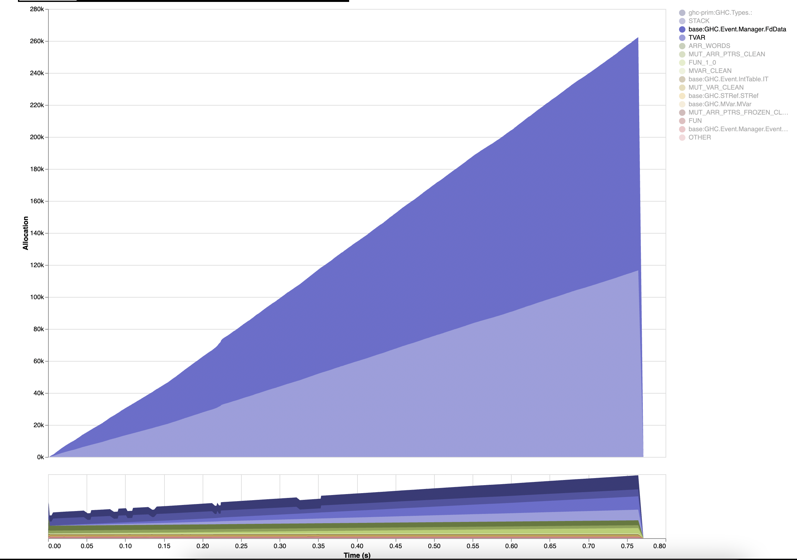

Reproduces a very small leak of `FdData` closures when repeatedly cancelling and restarting a thread that blocks on `getNotification`.

Here's a `-hT` profile showing the closures that aren't getting cleaned up after several minutes of runtime:

